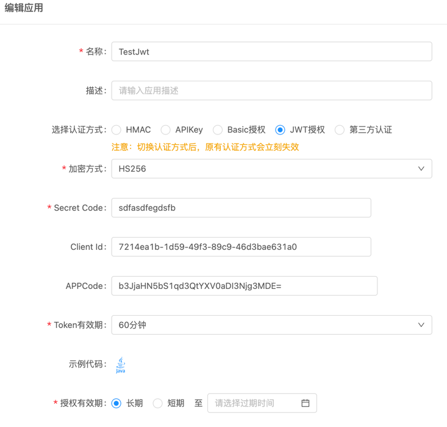

# JWT认证SDK使用说明

Java版本的SDK，用于生成Orchsym API Gateway JWT 认证所需的token。

支持 Java 8+。


### JWT简介

* JWT(全称：Json Web Token)是一个开放标准(RFC 7519)，它定义了一种紧凑的、自包含的方式，用于作为JSON对象在各方之间安全地传输信息。该信息可以被验证和信任，因为它是数字签名的。

### 生成token

1. 使用RS256算法
- 1.生成秘钥对秘钥对 keySize为 1024或2048
```
    OrchsymRSA256KeyGenerator orchsymRSA256KeyGenerator = new OrchsymRSA256KeyGenerator(keySize);
```

- 2.通过clientId,tokenPeriod和生成的私钥生成token
```
    JwtGenerator jwtGenerator = new JwtGenerator(privateKey, client, tokenPeriod, "RS256");
```

2). 使用HS256算法
- 1.通过clientId,tokenPeriod,secretCode生成token
```
    JwtGenerator jwtGenerator = new JwtGenerator(secretCode, client, tokenPeriod, "HS256");
```

### 

### 构建请求头报文：

设置header：  

```
  orchsym_app_code : 对应编辑app页APPCode字段
  Authorization : bearer + " " + 刚才生成的token
```
### 测试方法说明：

#### JwtTest.test(String privateKey, String clientId, String appCode, int tokenPeriod, String algorithm)

描述：生成 Jwt Token 实例，发送请求。

参数：
- str HS256算法时为privateKey, RS256算法时为secretCode
- clientId 编辑app页Client Id字段,作为生成token payload中的sub字段
- appCode 编辑app页APPCode字段
- tokenPeriod 编辑app页Token有效期 单位秒 最大不超过60 * 60
- algorithm 生成Jwt算法 HS256或者RS256



### 代码示例：
```
    public static void main(String[] args) throws IOException, NoSuchAlgorithmException, InvalidKeySpecException {

        // 对应编辑app页APPCode字段
        String appCode = "b3JjaHN5bS1qd3QtYXV0aDk3MDM=";
        // 对应编辑app页Client Id字段 ,作为生成token payload中的sub字段
        String clientId = "2aed9b77-2ed6-47da-828f-40d19e67ad65";
        // 对应编辑app页privateKey字段
        String privateKey = "MIIEvgIBADANBgkqhkiG9w0BAQEFAASCBKgwggSkAgEAAoIBAQCbFbJCxW7RFVhTS8m4LRAKpW+j2EKInL43Wcyaa2vMJQEfdNEWYw3Fo6KA9u/40RrrVrrKkY+ZBNc0lxZkt3f9Ob4zxF4aVqMrWo5Fs3xMnEhIu+jDxCSIx1gdWTBcuVWMtIb6dMbX3e8eLujog3KkMT9oFTzHqyPe2gtH6/14jGwnwZq278QUkURqvT/0/0a5pbzYIVNnO5ceWqsb9d54EDsTZPgd3giu8wZwNaHgVaIXvRW9mAs2KBAMTbBIMB0bhWVsIW4cVYn/gamj15GItvKlPEdFcucQtW+p3xHh+I7hdeCF+DvqJ2gGyhKH4L7h+JN97F6TtT1mMPVYdNEZAgMBAAECggEBAIJvyCOyzNbcPhKo7ruSYyihJnnG/YbLVo1VYOoMKXllMkGTzfwnScEONTKE/ybmMN75blfL/9vyn1KjNPl2+luoQlpl8cPzVH+1RW5IXOZOl9lc+pQVF6lXCLx+dFe4pcSXXeOvbkLHbkOTrt9JF5YTucHAAwPo5F2eRNi0GtdU7LBKakJ/WS8sRUBVofunwJSduzAR8VX/bC2sfZfS/FXW+6eay2jOtG/CLZJGIVGOMD+87ad2PRz6baa6cZFeDUgTZFeAHbTgQhsUn0B2dQiX0XbcYIJYDY3oXMW3QOyT2exwBd4EXEU7/VWs7r3IrB2p3g4jlEG1HrT1PhNNnAECgYEAy1PWT2kI7WmBeTYRH9cmqyPNxcyHcWTIAlGHRzaa8RQqonvFEFby4IMVhu9qHl4A3qaqbCX/pQw+cqL7l7cD4ZN8c/V0tU9ojWQUSyrIIOwTQKHmmrPJMeFet2U2QrEZHGnOLR3GQW3Ut2K3kaIZvkGysjE/UtJlV1veTVcxpoECgYEAw0KF919WnXT7JKOGErBBUVNRGpucoDHw3HYtlPKmMnrk40jGmhMahfYeQv10a6cUTkQA5pbGFSk2oPyf2GSDwtyjNQ/wphtrcB1ZUpQQVEzAxyMNMDfpzypcREClhwhjp6ckwdiWP4e0fgTwErsUgxj9CPw6hjTF4sU1+2aNTpkCgYAQ68M0DJuvlk4uFi/KpI8VQv+G7ISBDVAP0VUeug6e7Xy21PILcBD6Wi5acmY0bMJJxTj9kxP5WlGAHMwvTg3Gog2DYPP7esZKrf96We8ZvkvD3zVfvoKJ4iWNwaCIYFCkqrF707SCEW/YayC3v/PAf5stdSe97sB8SqrvaMg7AQKBgQCvt9QbtD6cYMQKSubDNr7xUwtv6I5hU9AwdmG640tRrmsBZ2LjEUITQFQncTQuFSQe8u/kk9cbAAXbhrzK3ln9KNXvULL+qTpcoOzbdcfkNVZfX1nlBMxy1OpHue28wX39SFu53xIHhjaWGhd6o8Vn3TsJtQNt91wGIffckIOmMQKBgEF5im4o8UqtiUs/+7U6ApGF3+50VlA6hGyKLuagcmEWe2X9Brsg9jvSk+juHRdRkatTUHva1Z5ZgyyFoJehUX+a0T24kTHskXhc/xD9pzexsFebi/FhVj09keQ/wPjf7mYOngxZDG1yl+djrfAQ8/GH5gXtaDFT+maz30rTac7O";
        // 对应编辑app页Token有效期 单位秒 最大不超过60 * 60
        int tokenPeriod = 300;
        // jwt生成算法
        String algorithm = "RS256";

        JwtTest.test(privateKey, appCode, clientId, tokenPeriod, algorithm);
    }

    private static void test(String str, String clientId, String appCode, int tokenPeriod, String algorithm) throws IOException, NoSuchAlgorithmException, InvalidKeySpecException {
    
        String urlStr = "http://172.18.89.241/env-101/por-4203/testlinhu/r0224/app/mock/285744/app/mock/yst/hello4";

        JwtGenerator jwtGenerator = new JwtGenerator(str, clientId, tokenPeriod, algorithm);

        System.out.println("token : " + jwtGenerator.getToken());

        OkHttpClient client = new OkHttpClient();
        Request request = new Request.Builder()
                .url(urlStr)
                .addHeader("orchsym_app_code", appCode)
                .addHeader("Authorization", "bearer " + jwtGenerator.getToken())
                .build();

        Call call = client.newCall(request);
        Response response = call.execute();
        System.out.println("Response Code: " + response.code());

        ResponseBody body = response.body();
        if (body != null) {
            System.out.println("Response Body: " + body.string());
        }

        response.close();
    }
```


